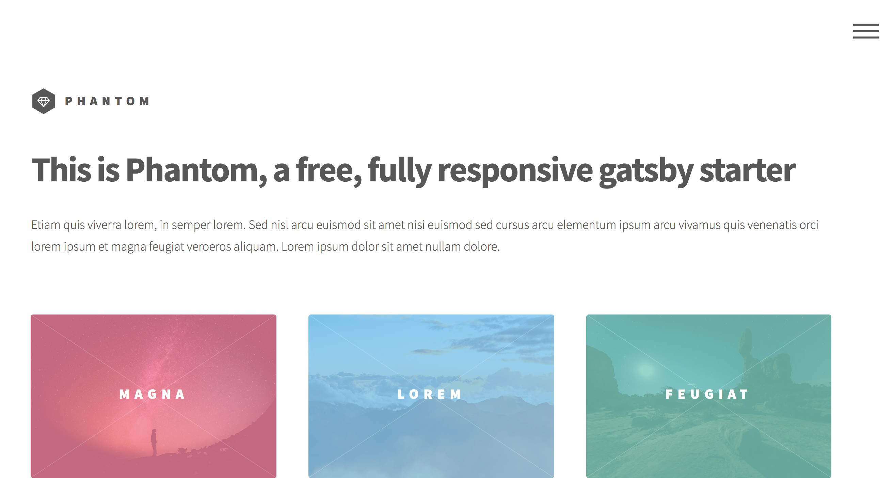

Oasis MD - Encinitas
499 N. El Camino Real
Suite C-200
Encinitas, CA 92024

Oasis MD - San Diego
8901 Activity Road San Diego, CA 92126

Practice Phone: +17602284798

Office Hours: 9a-3p M, Tues, Wed, Fri: Encinitas Office

Thurs: 10a-5pm San Diego office

Facebook Link: Dr. Becca Rodriguez Regner
Twitter Link: sDOlympicdoc

Your Full Name: Rebeccah Rodriguez Regner D.O., FACOFP, FAOASM

Practice Areas: Encinitas and San Diego

Affiliations, etc:
AOA,
AOASM,
ACOFP,
ACOFP CA,
Team USA Physician,
USA Womens Waterpolo,
USA Rugby,
San Diego Legion,
San Diego Ballet

Dr. Rebeccah Rodriguez Regner graduated from KCOM and is board certified in Family Medicine and Sports Medicine. Dr. Rodriguez serves the USOPC as a Team USA physician and was on the medical staff at the Olympic Training Site in Chula Vista, CA as team physician for 10 years.

She is honored to currently serve on the USOPC Physician Advisory Board. Dr. Rodriguez served as the Medical Director for the high performance center for Team USA (11 sports) at the 2016 Olympics in Rio. She Was part of the medical staff as Team USA physician at the 2019 Pan American Games in Lima. Peru.

Dr. Rodriguez is also a team physician for USA Womens Waterpolo and USA Rugby. She is the head team physician for the major league rugby team, the San Diego Legion.

Dr. Rodriguez is passionate about improving quality healthcare and helps make policy for national organizations such as: the AOASM as Vice President, ACOFP California Board, ACOFP Health and Wellness and Procedural Committee, and the President’s Council for Sports, Fitness and Nutrition. Currently, Dr. Rodriguez is in private practice at Oasis MD and is a fellow of both the ACOFP and AOASM. She travels the world with Team USA, loves to be active with sports and spend time with her husband and son.

# gatsby-starter-phantom

Gatsby.js V2 starter template based on Phantom by HTML5 UP

For an overview of the project structure please refer to the [Gatsby documentation - Building with Components](https://www.gatsbyjs.org/docs/building-with-components/).


Check online preview [here](https://anubhavsrivastava.github.io/gatsby-starter-phantom/)

## Screenshot



## Install

Make sure that you have the Gatsby CLI program installed:

```sh
npm install --global gatsby-cli
```

And run from your CLI:

```sh
gatsby new <site-name> https://github.com/anubhavsrivastava/gatsby-starter-phantom
```

Then you can run it by:

```sh
cd gatsby-example-site
npm install
gatsby develop
```

### Personalization

Edit `config.js` to put up your details

```javascript
module.exports = {
  siteTitle: 'Gatsby Starter phantom', // <title>
  ...
  heading: 'Anubhav',
  subHeading: 'Web Developer',
  // social
  socialLinks: [
    {
      icon: 'fa-github',
      name: 'Github',
      url: 'https://github.com/anubhavsrivastava',
    }
    ...
  ],
};

```

### Deploying using Github page

`package.json` has a default script that uses `gh-pages` module to publish on Github pages. Simply running `npm run deploy` would publish the site on github pages.

Additionally, it also has [path-prefix](https://www.gatsbyjs.org/docs/path-prefix/) value set for gatsby config in `config.js`. Change `pathPrefix` to relevant path if your gatsby site is hosted on subpath of a domain, `https://theanubhav.com/somePath/`. If you are hosting it as root site, i.e, `https://theanubhav.com/` , remove the pathPrefix configuration.

### Checkout other similar starters

- [gatsby-starter-casual](https://github.com/anubhavsrivastava/gatsby-starter-casual)
- [gatsby-starter-grayscale](https://github.com/anubhavsrivastava/gatsby-starter-grayscale)
- [gatsby-starter-resume](https://github.com/anubhavsrivastava/gatsby-starter-resume)
- [gatsby-starter-spectral](https://github.com/anubhavsrivastava/gatsby-starter-spectral)
- [gatsby-starter-newage](https://github.com/anubhavsrivastava/gatsby-starter-newage)
- [gatsby-starter-stylish](https://github.com/anubhavsrivastava/gatsby-starter-stylish)
- [gatsby-starter-solidstate](https://github.com/anubhavsrivastava/gatsby-starter-solidstate)
- [gatsby-starter-readonly](https://github.com/anubhavsrivastava/gatsby-starter-readonly)
- [gatsby-starter-prologue](https://github.com/anubhavsrivastava/gatsby-starter-prologue)
- [gatsby-starter-paradigmshift](https://github.com/anubhavsrivastava/gatsby-starter-paradigmshift)
- [gatsby-starter-overflow](https://github.com/anubhavsrivastava/gatsby-starter-overflow)
- [gatsby-starter-multiverse](https://github.com/anubhavsrivastava/gatsby-starter-multiverse)
- [gatsby-starter-identity](https://github.com/anubhavsrivastava/gatsby-starter-identity)
- [gatsby-starter-highlights](https://github.com/anubhavsrivastava/gatsby-starter-highlights)
- [gatsby-starter-fractal](https://github.com/anubhavsrivastava/gatsby-starter-fractal)
- [gatsby-starter-eventually](https://github.com/anubhavsrivastava/gatsby-starter-eventually)
- [gatsby-starter-directive](https://github.com/anubhavsrivastava/gatsby-starter-directive)
- [gatsby-starter-creative](https://github.com/anubhavsrivastava/gatsby-starter-creative)
- [gatsby-starter-aerial](https://github.com/anubhavsrivastava/gatsby-starter-aerial)

### Contribution

Suggestions and PRs are welcome!

Please create issue or open PR request for contribution.

### License

[](LICENSE)

refer `LICENSE` file in this repository.
